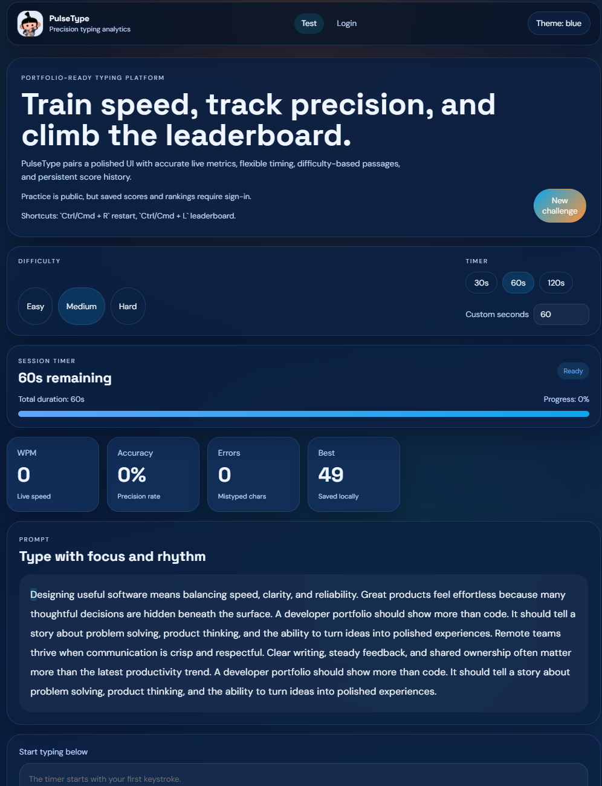
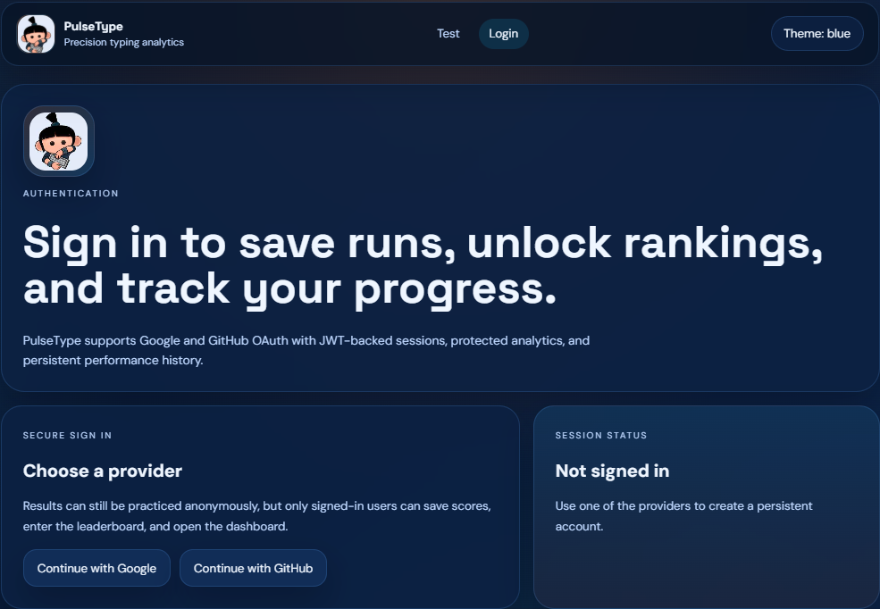
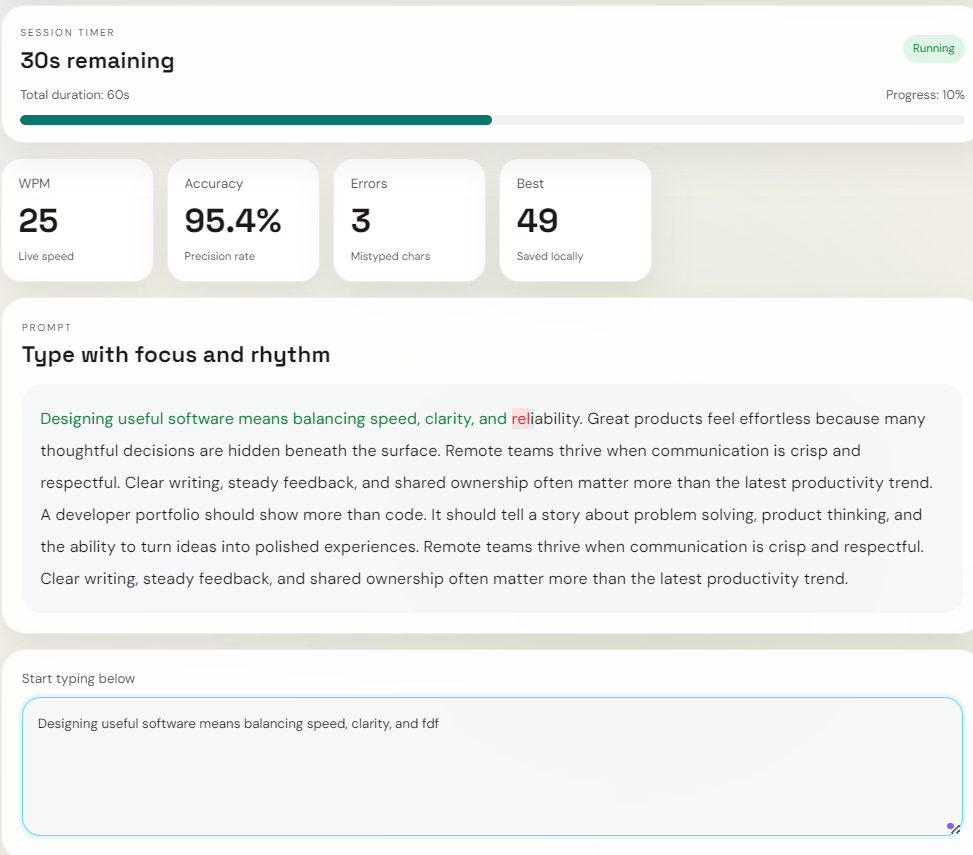
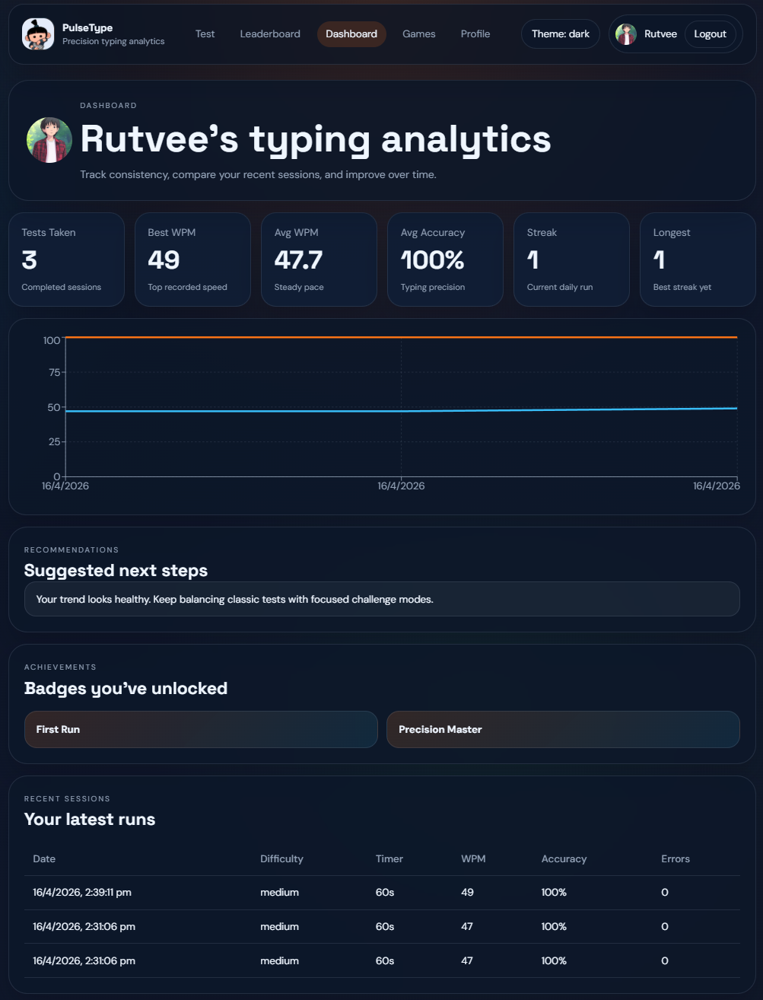
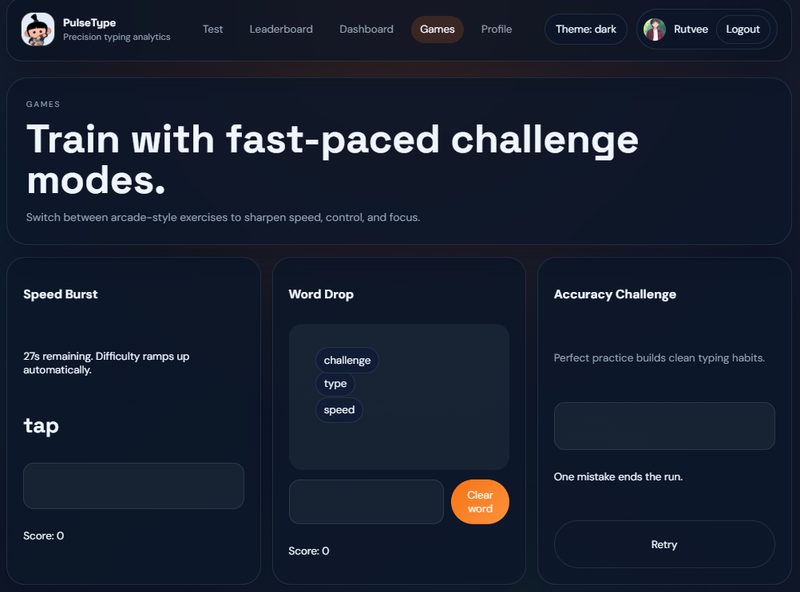
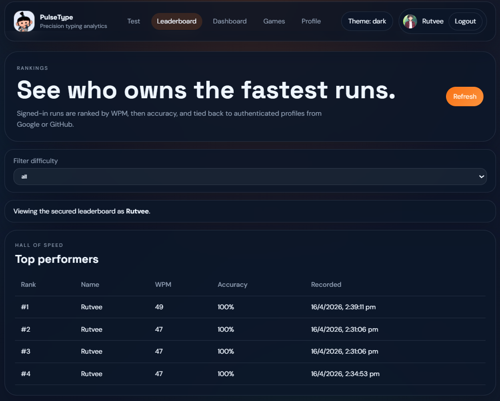
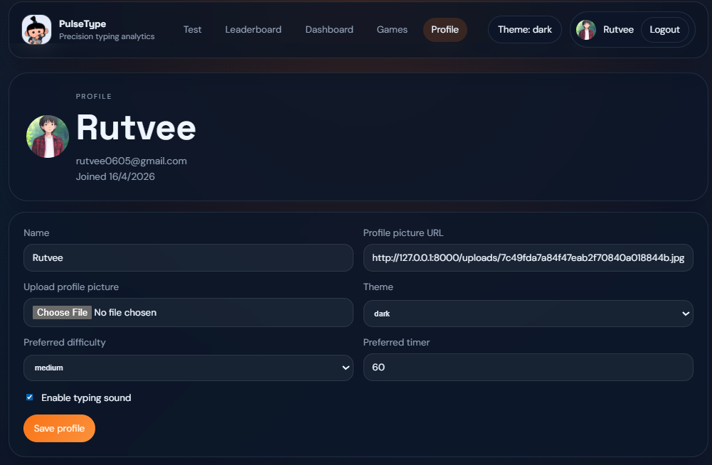

# ⌨️ PULSETYPE – Full Stack Typing Test Platform

A production-ready, full-stack Typing Test Web Application with authentication, gamification, performance analytics, and intelligent recommendations.

Built to simulate a real-world product with modern UI/UX and scalable architecture.

---

## 🚀 Features

### 🔐 Authentication
- Google OAuth 2.0 Login
- GitHub OAuth Login
- Secure JWT-based session handling
- Persistent user sessions

---

### ⌨️ Typing Test System
- Real-time typing test with live character highlighting
- Multiple time modes (30s / 60s / 120s)
- WPM (Words Per Minute) calculation
- Accuracy tracking
- Error detection
- Restart functionality

---

### 🎮 Gamification (Typing Games)
- **Speed Burst Mode** – Type maximum words in limited time
- **Word Drop Game** – Type falling words before they reach bottom
- **Accuracy Challenge** – Test ends on first mistake

---

### 👤 User Profile System
- View and update profile details
- Upload profile picture
- Personalized settings (theme, preferences)

---

### 🎨 Themes & UI
- Light Mode / Dark Mode
- Custom themes (Neon, Minimal, Blue)
- Responsive design (mobile + desktop)
- Smooth animations and modern UI

---

### 📊 Performance Analytics
- Best WPM
- Average WPM
- Accuracy trends
- Typing history
- Interactive charts (performance over time)

---

### 🧠 Smart Recommendations
- Personalized suggestions based on:
  - Typing speed
  - Accuracy
  - Error patterns
- Helps users improve typing efficiency

---

### 🏆 Leaderboard
- Global ranking system
- Compare scores with other users
- Filter by difficulty

---

### 🔥 Advanced Features
- Daily streak tracking
- Achievement & badge system
- Progress animations
- Keyboard shortcuts
- Sound effects (optional)

---

## 📸 Screenshots

### ⚡ Home Page


### 🔐 Login Page


### ⌨️ Typing Test


### 📊 Dashboard


### 🎮 Typing Game


### 📑 Leaderboard


### 💻 Porfile


---

## 🛠 Tech Stack

### Frontend
- React.js (Hooks + Context API)
- Tailwind CSS
- Framer Motion
- Chart.js / Recharts

### Backend
- FastAPI (Python)
- REST API architecture
- Authlib (OAuth integration)

### Database
- PostgreSQL / SQLite

### Authentication
- Google OAuth 2.0
- GitHub OAuth
- JWT (JSON Web Tokens)

---

## 📂 Project Structure
/client
/src
/components
/pages
/context
/services
/assets

/server
/app
/api
/models
/schemas
/services
main.py


---

## ⚙️ Setup Instructions

### 🔹 1. Clone the repository
```bash
git clone https://github.com/your-username/pulsetype-typingtest.git
cd pulsetype-typingtest
```

### 🔹 2. Backend Setup
```bash
cd server
pip install -r requirements.txt
uvicorn main:app --reload
```

### 🔹 3. Frontend Setup
```bash
cd client
npm install
npm run dev
```

### 🔹 4. Environment Variables
-> Backend (/server/.env)

GOOGLE_CLIENT_ID=your_google_client_id
GOOGLE_CLIENT_SECRET=your_google_client_secret

GITHUB_CLIENT_ID=your_github_client_id
GITHUB_CLIENT_SECRET=your_github_client_secret

JWT_SECRET=your_secret_key
FRONTEND_URL=http://localhost:5173
ALLOWED_ORIGINS=http://localhost:5173

-> Frontend (/client/.env)

VITE_API_BASE_URL=http://localhost:8000/api
VITE_SERVER_BASE_URL=http://localhost:8000

---

## 🔐 OAuth Setup
Google
• Create OAuth credentials
• Add redirect URI: http://localhost:8000/api/auth/google/callback

GitHub
• Create OAuth App
• Add callback URL: http://localhost:8000/api/auth/github/callback

---

📈 How It Works
1.User logs in via Google/GitHub
2.Starts typing test
3.App calculates:
 • WPM
 • Accuracy
4.Results are stored in database
5.Dashboard shows analytics
6.Recommendation system suggests improvements

---

## 🎯 Future Enhancements
• AI-based typing analysis (ML model)
• Multiplayer typing competition
• Cloud deployment (AWS / Vercel / Render)

---

→ 🤝 Contributing
Contributions are welcome! Feel free to fork the repo and submit pull requests.

→ 📬 Contact
LinkedIn: (Click here)[https://linkedin.com/in/rutvee-yadav]

→ ⭐ Show Your Support
If you like this project, give it a ⭐ on GitHub!
